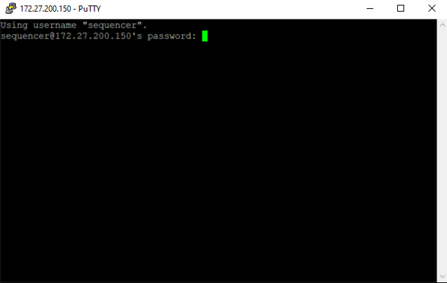

# Intersect VCF and BED file

## login to R\&D cluster

- Open putty


- As shown in the image, provide the Host Name `sequencer@172.27.200.150`
- Then, open a terminal by clicking the `Open` button

  

## how to run the script

```
python /isilon/RnD/tools/custom_script/bedtools/run_intersect_bed_vcf.py -i [VCF_input_directory] -b [bed file] -o [Output_directory]
```

## QIAseq297 and QIAseq323 BED and VCF intersect example
```
source /isilon/RnD/tools/bcbio_072619/env.sh

cd /isilon/R_and_D/NovaSeqOutput/IDTWES/2022/05_MAY/IDTWES-050222RnD-umi/final/

python /isilon/RnD/tools/custom_script/bedtools/run_intersect_bed_vcf.py -i IDTWES-050222RnD-umi_merged_unfiltered_vcfs -b /isilon/RnD/tools/custom_script/bedtools/QIAseq297.CDHS-23947Z-19392.refseq-anno_STAG2ex12extended.roi_sorted.bed -o intersect_297

python /isilon/RnD/tools/custom_script/bedtools/run_intersect_bed_vcf.py -i IDTWES-050222RnD-umi_merged_unfiltered_vcfs -b /isilon/RnD/tools/custom_script/bedtools/QIAseq323.CDHS-24104Z-14204.refseq-anno.roi.exons.nolowcovrois_sorted.bed -o intersect_323
```
